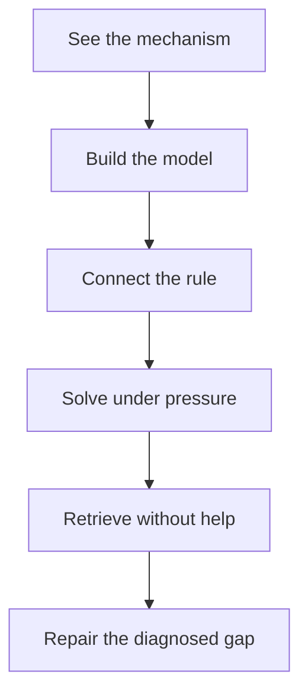

# Human-Centered AI Learning Systems

An evidence-backed, usage-ready public release of AI-assisted learning-system design by [`maitranilim`](https://github.com/maitranilim).

The work treats an AI model as a production collaborator, not an autonomous author. The central contribution is the human system around the model: problem framing, pedagogical architecture, evaluation criteria, iterative critique, acceptance decisions, and honest disclosure.

## Start here

If you have three minutes:

1. Read [Human-AI authorship](docs/HUMAN-AI-AUTHORSHIP.md).
2. Open the [Digital Logic case study](case-studies/digital-logic-teaching-book.md).
3. Run the [public methods release](completed/public-methods-release.md).
4. Reuse the [session brief](templates/learning-session-brief.md) and [exit gate](templates/exit-gate.md).
5. Review the [explanation-quality rubric](rubrics/explanation-quality.md).

## What this public release contains

| Public component | What you can use |
|---|---|
| [`completed/`](completed/) | A complete, compact learning-system method release |
| [`samples/`](samples/) | Readable examples, diagrams, and recall loops |
| [`templates/`](templates/) | Copyable briefs, error logs, and progression gates |
| [`case-studies/`](case-studies/) | Problem, intervention, evidence, and limitations |
| [`docs/`](docs/) | System architecture, authorship, evaluation, and scope |
| [`rubrics/`](rubrics/) | Reusable quality gates and error categories |
| [`contribution-log/`](contribution-log/) | An evidence-limited record of human directions that changed the system |

The large finished PDFs and DOCX files are intentionally withheld from this public release. They are preserved in a separate private proprietary archive. See [the boundary note](PUBLIC-PRIVATE-BOUNDARY.md).

## The recurring learning architecture

This loop turns a broad request such as “teach Digital Logic” into observable behaviors. A learner should be able to explain the mechanism, reconstruct the rule, transfer it to a problem, retrieve it later, and repair a specific error.

## What `maitranilim` contributed

- Owned the problem definition and learner constraints.
- Rejected shallow summaries and answers that only sounded competent.
- Specified whole-concept teaching rather than source-page paraphrase.
- Designed the learning loops, dependency order, retrieval rhythm, and exit gates.
- Required diagrams to carry explanatory work, not serve as decoration.
- Defined error categories and evidence required before moving on.
- Iteratively critiqued model outputs and decided what passed.
- Curated the public release and its provenance boundaries.

The professional vocabulary for that work includes **problem framing**, **specification ownership**, **pedagogical architecture**, **instructional systems design**, **human-in-the-loop supervision**, **evaluation design**, **quality-gate design**, and **error analysis**.

## What ChatGPT and Codex contributed

- Draft generation and restructuring under the human specification.
- Research support and source synthesis.
- Worked examples, practice-question drafting, and diagram generation.
- Document layout, rendering, file production, and repository assembly.
- Consistency checks and explicit limitation tracking.

The AI assistance was substantial. This repository does not claim that `maitranilim` manually authored every sentence, drew every diagram, or wrote the document-generation code.

## Why this is relevant

For AI learning and education technology, this is a portfolio of operational pedagogy rather than a collection of prompts. For AI evaluation and product safety, it demonstrates:

- acceptance criteria that can be checked;
- safeguards against false confidence and unsupported outcome claims;
- progressive help instead of answer dumping;
- error diagnosis before content repetition;
- provenance and role disclosure;
- explicit boundaries between artifact quality and measured learner impact.

## Status

This is a living public release. New findings should be logged with evidence and then promoted into a rubric, workflow, sample, or completed method when they are repeatable. Personal conversations, private learner data, and unreleased production files do not belong here.

## License and attribution

Code and software-like templates are available under the MIT License. Original educational text, diagrams, and documentation are offered under CC BY 4.0 to the extent that `maitranilim` controls the applicable rights. See [LICENSING.md](LICENSING.md) for AI-generated material and third-party boundaries.
