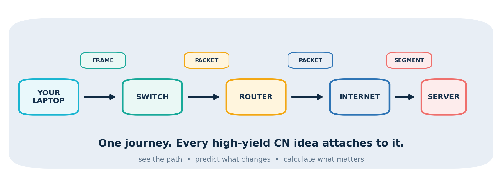

# Case study: Computer Networks Sprintbook

## Problem

Computer Networks often becomes a list of protocol facts. That makes recognition easy and transfer difficult. The design goal was a compact, visual study object that lets a learner predict what a packet, frame, window, route, or acknowledgement will do.

## Human specification

`maitranilim` asked for:

- visual, high-yield teaching rather than decorative illustration;
- one major idea per sprint;
- core recurring concepts before lower-priority completeness;
- a short loop suitable for distracted study;
- teach-back and closed-book retrieval;
- worked numericals and original GATE-style questions;
- a mistake code that determines the repair.

## AI production role

ChatGPT and Codex assisted with topic synthesis, diagram generation, worked examples, question drafting, layout, and DOCX production.

## Inspectable evidence

- 19 embedded diagrams.
- 10 original retrieval questions with worked answers.
- Mechanism-first coverage from encapsulation and delay through IPv4, routing, TCP, and HTTP timing.
- A three-pass finish: 3 hours, 2 hours, then 90 minutes.
- Retrieval checkpoints on the same day, after 24 hours, after 7 days, and before the exam.

The complete production DOCX is retained in the private archive. Start with the [public methods release](../completed/public-methods-release.md) and [sample recall loop](../samples/computer-networks-recall-loop.md).

## Reusable pattern

Every visual should answer at least one operational question:

- What object is moving?
- Which boundary does it cross?
- Which identifier is inspected?
- What changes at this step?
- What stays end-to-end?
- Which formula corresponds to the pictured mechanism?

If a diagram cannot support a prediction or reconstruction, it is decoration rather than instruction.

## Limitations

- Priority labels are planning inferences, not exam predictions.
- Protocol variants and question-specific conventions can override defaults.
- The artifact has not been tested against a comparison group.
- The DOCX preserves AI authorship metadata and should be represented as AI-assisted work.
