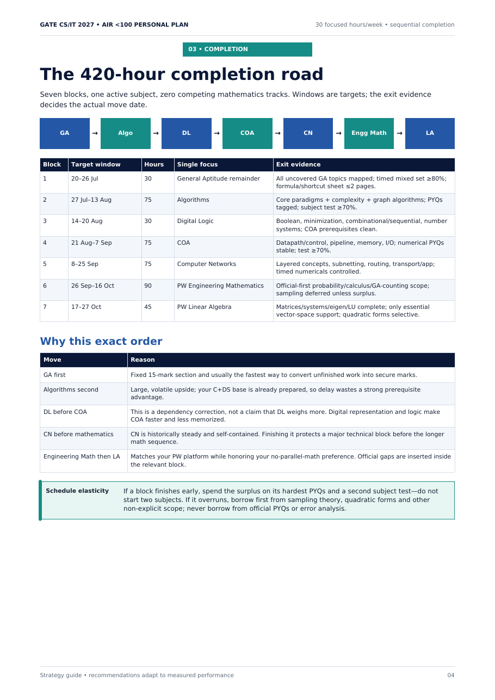

# Case study: Evidence-gated study planning

## Problem

A study calendar can create motion without mastery. It can also encourage full lecture replay whenever confidence drops, even when the actual gap is narrow.

## Human specification

`maitranilim` supplied a constrained preparation profile that materially changed the system:

- one active completion subject at a time;
- completed subjects revised through retrieval, not lecture replay;
- progress decided by evidence rather than date alone;
- formulas connected to definitions, assumptions, derivations, boundaries, and transfer;
- mistakes classified before repair.

## AI production role

ChatGPT and Codex assisted with sequencing, synthesis, calculations, layout, and PDF production.

## Inspectable evidence

- A sequential completion road.
- Weekly integration of concept work, past questions, recall, testing, analysis, and repair.
- Subject exit gates and adaptive control bands.
- A mistake ledger and repeat-error closure rule.
- Explicit refusal to guarantee an AIR-under-100 outcome.



The complete personalized guide is retained in the private archive. Start with the [public methods release](../completed/public-methods-release.md) and [sample exit-gate logic](../samples/evidence-gated-study-plan.md).

## Reusable pattern

```text
diagnostic attempt
    -> classify the loss
    -> apply the smallest targeted repair
    -> solve isomorphic questions
    -> schedule blind retest
    -> close only after non-recurrence
```

## Why this is product-safety relevant

The plan separates an aspirational target from claims the system can support. It makes assumptions visible, prevents a low-confidence feeling from triggering expensive repetition, and demands evidence before escalation. Those are useful patterns for any AI product that recommends consequential next steps.

## Limitations

- The schedule was personalized to one preparation profile.
- Planning thresholds are recommendations, not validated universal cutoffs.
- No rank or score outcome is claimed.
- Official syllabus and exam details require fresh verification.
